# GearShow ERD (Entity-Relationship Diagram)

---

> **FK 전략**: 같은 생명주기(Aggregate)를 공유하는 엔티티 간에는 FK를 사용하고,
> 서로 다른 Aggregate 간 참조는 ID 값만 보유하는 논리적 참조를 사용한다.

## Aggregate 경계

| Aggregate Root | 종속 엔티티 | 참조 방식 |
|:--------------|:-----------|:---------|
| USER | AUTH_ACCOUNT | FK |
| CATALOG_ITEM | BOOTS_SPEC, UNIFORM_SPEC | FK |
| SHOWCASE | SHOWCASE_IMAGE, SHOWCASE_SPEC, SHOWCASE_3D_MODEL, MODEL_SOURCE_IMAGE, SHOWCASE_COMMENT | FK |
| CHAT_ROOM | CHAT_MESSAGE, CHAT_READ_MARKER | FK |
| TRANSACTION_TICKET | — | (독립 Aggregate) |
| TRANSACTION | PAYMENT | FK |

---

## ER Diagram

```mermaid
erDiagram
    USER {
        bigint userId PK
        string nickname
        string profileImageUrl
        string phoneNumber
        boolean isPhoneVerified
        enum userStatus
        timestamp createdAt
        timestamp updatedAt
    }

    AUTH_ACCOUNT {
        bigint authAccountId PK
        bigint userId FK "FK → USER (같은 Aggregate)"
        enum providerType
        string providerUserKey
        enum authStatus
        timestamp createdAt
        timestamp lastLoginAt
    }

    CATALOG_ITEM {
        bigint catalogItemId PK
        enum category
        string brand
        string modelCode
        string officialImageUrl
        enum catalogStatus
        timestamp createdAt
        timestamp updatedAt
    }

    BOOTS_SPEC {
        bigint bootsSpecId PK
        bigint catalogItemId FK "FK → CATALOG_ITEM (같은 Aggregate)"
        enum studType
        string siloName
        string releaseYear
        string surfaceType
        json extraSpecJson
        timestamp createdAt
        timestamp updatedAt
    }

    UNIFORM_SPEC {
        bigint uniformSpecId PK
        bigint catalogItemId FK "FK → CATALOG_ITEM (같은 Aggregate)"
        string clubName
        string season
        string league
        enum kitType
        json extraSpecJson
        timestamp createdAt
        timestamp updatedAt
    }

    SHOWCASE {
        bigint showcaseId PK
        bigint ownerId "논리 참조 → USER"
        bigint catalogItemId "논리 참조 → CATALOG_ITEM (nullable)"
        enum category "BOOTS, UNIFORM 등"
        string brand "브랜드명"
        string modelCode "모델 코드 (nullable)"
        string title
        text description
        string userSize
        enum conditionGrade
        int wearCount
        boolean isForSale
        string primaryImageUrl "비정규화: 대표 이미지 URL"
        boolean has3dModel "비정규화: 3D 모델 보유 여부"
        enum showcaseStatus
        timestamp createdAt
        timestamp updatedAt
    }

    SHOWCASE_SPEC {
        bigint showcaseSpecId PK
        bigint showcaseId FK "FK → SHOWCASE (같은 Aggregate), UNIQUE"
        enum specType "스펙 타입 (BOOTS, UNIFORM)"
        json specData "카테고리별 스펙 JSON 데이터"
        timestamp createdAt
        timestamp updatedAt
    }

    SHOWCASE_IMAGE {
        bigint showcaseImageId PK
        bigint showcaseId FK "FK → SHOWCASE (같은 Aggregate)"
        string imageUrl
        int sortOrder
        boolean isPrimary
        timestamp createdAt
    }

    SHOWCASE_3D_MODEL {
        bigint showcase3dModelId PK
        bigint showcaseId FK "FK → SHOWCASE (같은 Aggregate)"
        string modelFileUrl
        string previewImageUrl
        enum modelStatus
        string generationProvider
        timestamp requestedAt
        timestamp generatedAt
        string failureReason
        timestamp createdAt
    }

    MODEL_SOURCE_IMAGE {
        bigint modelSourceImageId PK
        bigint showcase3dModelId FK "FK → SHOWCASE_3D_MODEL (같은 Aggregate)"
        string imageUrl
        enum angleType
        int sortOrder
        timestamp createdAt
    }

    SHOWCASE_COMMENT {
        bigint showcaseCommentId PK
        bigint showcaseId FK "FK → SHOWCASE (같은 Aggregate)"
        bigint authorId "논리 참조 → USER"
        text content
        enum commentStatus
        timestamp createdAt
        timestamp updatedAt
    }

    CHAT_ROOM {
        bigint chatRoomId PK
        bigint showcaseId "논리 참조 → SHOWCASE"
        bigint sellerId "논리 참조 → USER"
        bigint buyerId "논리 참조 → USER"
        enum chatRoomStatus
        timestamp createdAt
        timestamp lastMessageAt
    }

    CHAT_MESSAGE {
        bigint chatMessageId PK
        bigint chatRoomId FK "FK → CHAT_ROOM (같은 Aggregate)"
        bigint senderId "논리 참조 → USER (시스템 메시지는 NULL)"
        bigint seq "채팅방 내 단조 증가 순번"
        enum messageType "TEXT, IMAGE, SYSTEM_*"
        text content
        json payloadJson "시스템 메시지 부가 정보 (ticketId 등)"
        enum messageStatus "ACTIVE, DELETED"
        timestamp sentAt
    }

    CHAT_READ_MARKER {
        bigint chatReadMarkerId PK
        bigint chatRoomId FK "FK → CHAT_ROOM (같은 Aggregate)"
        bigint userId "논리 참조 → USER"
        bigint lastReadMessageId "논리 참조 → CHAT_MESSAGE"
        timestamp updatedAt
    }

    TRANSACTION_TICKET {
        string ticketId PK "UUID"
        enum contextType "SHOWCASE_DIRECT, SHOWCASE_ESCROW"
        bigint contextRefId "논리 참조 (현재: showcaseId)"
        bigint issuedByUserId "논리 참조 → USER"
        bigint sellerId "논리 참조 → USER"
        bigint buyerId "논리 참조 → USER"
        int amount
        enum paymentMethod "CASH, ESCROW"
        enum ticketStatus "ISSUED, USED, EXPIRED, CANCELLED"
        timestamp expiresAt
        timestamp usedAt
        bigint usedByTransactionId "논리 참조 → TRANSACTION"
        timestamp createdAt
    }

    TRANSACTION {
        bigint transactionId PK
        string ticketId "논리 참조 → TRANSACTION_TICKET"
        bigint showcaseId "논리 참조 → SHOWCASE"
        bigint sellerId "논리 참조 → USER"
        bigint buyerId "논리 참조 → USER"
        enum transactionMethod "DIRECT, ESCROW"
        decimal askingPriceSnapshot
        decimal agreedPrice
        enum transactionStatus
        timestamp createdAt
        timestamp completedAt
        timestamp cancelledAt
    }

    PAYMENT {
        bigint paymentId PK
        bigint transactionId FK "FK → TRANSACTION (같은 Aggregate)"
        enum paymentProvider
        enum paymentMethod
        enum paymentStatus
        decimal amount
        timestamp paidAt
        timestamp cancelledAt
        string failureReason
        timestamp createdAt
    }

    USER ||--|{ AUTH_ACCOUNT : has
    CATALOG_ITEM ||--o| BOOTS_SPEC : has
    CATALOG_ITEM ||--o| UNIFORM_SPEC : has
    CATALOG_ITEM ||--o{ SHOWCASE : referenced_by
    USER ||--o{ SHOWCASE : owns
    SHOWCASE ||--o| SHOWCASE_SPEC : has
    SHOWCASE ||--|{ SHOWCASE_IMAGE : contains
    SHOWCASE ||--o| SHOWCASE_3D_MODEL : has
    SHOWCASE_3D_MODEL ||--|{ MODEL_SOURCE_IMAGE : contains
    SHOWCASE ||--o{ SHOWCASE_COMMENT : has
    USER ||--o{ SHOWCASE_COMMENT : writes
    SHOWCASE ||--o{ CHAT_ROOM : has
    USER ||--o{ CHAT_ROOM : participates
    CHAT_ROOM ||--o{ CHAT_MESSAGE : contains
    USER ||--o{ CHAT_MESSAGE : sends
    CHAT_ROOM ||--|{ CHAT_READ_MARKER : tracks
    USER ||--o{ CHAT_READ_MARKER : marks
    SHOWCASE ||--o{ TRANSACTION_TICKET : referenced_by
    USER ||--o{ TRANSACTION_TICKET : issues
    TRANSACTION_TICKET ||--o| TRANSACTION : consumed_by
    SHOWCASE ||--o{ TRANSACTION : has
    TRANSACTION ||--o| PAYMENT : has
```

---

## 테이블 상세 명세

### USER (사용자)

| 컬럼명 | 타입 | 제약조건 | 설명 |
|:------|:-----|:--------|:-----|
| userId | bigint | PK | 사용자 고유 식별자 |
| nickname | string | NOT NULL | 닉네임 |
| profileImageUrl | string | | 프로필 이미지 URL |
| phoneNumber | string | | 전화번호 |
| isPhoneVerified | boolean | NOT NULL, DEFAULT false | 전화번호 인증 여부 |
| userStatus | enum | NOT NULL | 사용자 상태 (ACTIVE, SUSPENDED, WITHDRAWN 등) |
| createdAt | timestamp | NOT NULL | 생성일시 |
| updatedAt | timestamp | NOT NULL | 수정일시 |

### AUTH_ACCOUNT (인증 계정)

> Aggregate: **USER** (FK로 연결)

| 컬럼명 | 타입 | 제약조건 | 설명 |
|:------|:-----|:--------|:-----|
| authAccountId | bigint | PK | 인증 계정 고유 식별자 |
| userId | bigint | NOT NULL, FK → USER | 사용자 ID |
| providerType | enum | NOT NULL | 인증 제공자 (KAKAO, GOOGLE, APPLE 등) |
| providerUserKey | string | NOT NULL | 제공자 측 사용자 고유 키 |
| authStatus | enum | NOT NULL | 인증 상태 (LINKED, UNLINKED 등) |
| createdAt | timestamp | NOT NULL | 생성일시 |
| lastLoginAt | timestamp | | 마지막 로그인 일시 |

### CATALOG_ITEM (카탈로그 아이템)

| 컬럼명 | 타입 | 제약조건 | 설명 |
|:------|:-----|:--------|:-----|
| catalogItemId | bigint | PK | 카탈로그 아이템 고유 식별자 |
| category | enum | NOT NULL | 카테고리 (BOOTS, UNIFORM 등) |
| brand | string | NOT NULL | 브랜드명 |
| modelCode | string | | 모델 코드 |
| officialImageUrl | string | | 공식 이미지 URL |
| catalogStatus | enum | NOT NULL | 카탈로그 상태 (ACTIVE, INACTIVE 등) |
| createdAt | timestamp | NOT NULL | 생성일시 |
| updatedAt | timestamp | NOT NULL | 수정일시 |

### BOOTS_SPEC (축구화 스펙)

> Aggregate: **CATALOG_ITEM** (FK로 연결)

| 컬럼명 | 타입 | 제약조건 | 설명 |
|:------|:-----|:--------|:-----|
| bootsSpecId | bigint | PK | 축구화 스펙 고유 식별자 |
| catalogItemId | bigint | NOT NULL, FK → CATALOG_ITEM, UNIQUE | 카탈로그 아이템 ID |
| studType | enum | NOT NULL | 스터드 타입 (FG, SG, AG, TF, IC 등) |
| siloName | string | | 사일로 이름 (Mercurial, Predator 등) |
| releaseYear | string | | 출시 연도 |
| surfaceType | string | | 적합 표면 (천연잔디, 인조잔디 등) |
| extraSpecJson | json | | 추가 스펙 (무게, 갑피 소재 등) |
| createdAt | timestamp | NOT NULL | 생성일시 |
| updatedAt | timestamp | NOT NULL | 수정일시 |

### UNIFORM_SPEC (유니폼 스펙)

> Aggregate: **CATALOG_ITEM** (FK로 연결)

| 컬럼명 | 타입 | 제약조건 | 설명 |
|:------|:-----|:--------|:-----|
| uniformSpecId | bigint | PK | 유니폼 스펙 고유 식별자 |
| catalogItemId | bigint | NOT NULL, FK → CATALOG_ITEM, UNIQUE | 카탈로그 아이템 ID |
| clubName | string | NOT NULL | 클럽 이름 |
| season | string | NOT NULL | 시즌 (2024-25 등) |
| league | string | | 리그 (EPL, LaLiga 등) |
| kitType | enum | NOT NULL | 킷 타입 (HOME, AWAY, THIRD) |
| extraSpecJson | json | | 추가 스펙 (소재, 핏 등) |
| createdAt | timestamp | NOT NULL | 생성일시 |
| updatedAt | timestamp | NOT NULL | 수정일시 |

### SHOWCASE (쇼케이스)

| 컬럼명 | 타입 | 제약조건 | 설명 |
|:------|:-----|:--------|:-----|
| showcaseId | bigint | PK | 쇼케이스 고유 식별자 |
| ownerId | bigint | NOT NULL, 논리 참조 → USER | 소유자 ID |
| catalogItemId | bigint | 논리 참조 → CATALOG_ITEM (nullable) | 카탈로그 아이템 ID (선택) |
| category | enum | NOT NULL | 카테고리 (BOOTS, UNIFORM 등) |
| brand | string | NOT NULL | 브랜드명 |
| modelCode | string | | 모델 코드 |
| title | string | NOT NULL | 제목 |
| description | text | | 상세 설명 |
| userSize | string | | 사용자 사이즈 (260, XL 등) |
| conditionGrade | enum | NOT NULL | 상태 등급 (S, A, B, C 등) |
| wearCount | int | DEFAULT 0 | 착용 횟수 |
| isForSale | boolean | NOT NULL, DEFAULT false | 판매 여부 |
| primaryImageUrl | string | | 대표 이미지 URL (비정규화, 목록 조회 최적화) |
| has3dModel | boolean | NOT NULL, DEFAULT false | 3D 모델 보유 여부 (비정규화, 목록 조회 최적화) |
| showcaseStatus | enum | NOT NULL | 쇼케이스 상태 (ACTIVE, HIDDEN, SOLD, DELETED) |
| createdAt | timestamp | NOT NULL | 생성일시 |
| updatedAt | timestamp | NOT NULL | 수정일시 |

### SHOWCASE_SPEC (쇼케이스 스펙)

> Aggregate: **SHOWCASE** (FK로 연결)
> 카테고리별 스펙을 단일 테이블에서 JSON으로 관리한다. 새 카테고리 추가 시 스키마 변경 없이 specType enum 값과 JSON 구조만 추가하면 된다.

| 컬럼명 | 타입 | 제약조건 | 설명 |
|:------|:-----|:--------|:-----|
| showcaseSpecId | bigint | PK | 쇼케이스 스펙 고유 식별자 |
| showcaseId | bigint | NOT NULL, FK → SHOWCASE, UNIQUE | 쇼케이스 ID |
| specType | enum | NOT NULL | 스펙 타입 (BOOTS, UNIFORM) |
| specData | json | NOT NULL | 카테고리별 스펙 JSON 데이터 |
| createdAt | timestamp | NOT NULL | 생성일시 |
| updatedAt | timestamp | NOT NULL | 수정일시 |

> **specData 예시**
> - BOOTS: `{"studType":"FG","siloName":"Mercurial","releaseYear":"2025","surfaceType":"천연잔디"}`
> - UNIFORM: `{"clubName":"Liverpool","season":"24-25","league":"EPL","kitType":"HOME"}`

### SHOWCASE_IMAGE (쇼케이스 이미지)

> Aggregate: **SHOWCASE** (FK로 연결)

| 컬럼명 | 타입 | 제약조건 | 설명 |
|:------|:-----|:--------|:-----|
| showcaseImageId | bigint | PK | 이미지 고유 식별자 |
| showcaseId | bigint | NOT NULL, FK → SHOWCASE | 쇼케이스 ID |
| imageUrl | string | NOT NULL | 이미지 URL |
| sortOrder | int | NOT NULL | 정렬 순서 |
| isPrimary | boolean | NOT NULL, DEFAULT false | 대표 이미지 여부 |
| createdAt | timestamp | NOT NULL | 생성일시 |

### SHOWCASE_3D_MODEL (쇼케이스 3D 모델)

> Aggregate: **SHOWCASE** (FK로 연결)

| 컬럼명 | 타입 | 제약조건 | 설명 |
|:------|:-----|:--------|:-----|
| showcase3dModelId | bigint | PK | 3D 모델 고유 식별자 |
| showcaseId | bigint | NOT NULL, FK → SHOWCASE, UNIQUE | 쇼케이스 ID |
| modelFileUrl | string | | 3D 모델 파일 URL (COMPLETED 시 S3 CDN URL) |
| previewImageUrl | string | | 미리보기 이미지 URL |
| modelStatus | enum | NOT NULL | 모델 상태 (REQUESTED, PREPARING, GENERATING, COMPLETED, FAILED, UNAVAILABLE) |
| generationProvider | string | | 생성 제공자 (tripo 등) |
| generationTaskId | string(100) | | Tripo task_id. GENERATING 상태에서만 non-null. 폴링 스케줄러가 상태 조회에 사용 |
| requestedAt | timestamp | | 요청 일시 |
| generatedAt | timestamp | | 생성 완료 일시 |
| lastPolledAt | timestamp | | 마지막 폴링 시각. stuck 감지(타임아웃 15분) 기준값 |
| failureReason | string | | 실패 사유 |
| retryCount | int | NOT NULL, DEFAULT 0 | Recovery 자동 재시도 횟수. PREPARING 좀비 복구 시 증가, 3회 초과 시 FAILED |
| createdAt | timestamp | NOT NULL | 생성일시 |

### MODEL_SOURCE_IMAGE (3D 모델 소스 이미지)

> Aggregate: **SHOWCASE** (SHOWCASE_3D_MODEL을 통해 FK로 연결)

| 컬럼명 | 타입 | 제약조건 | 설명 |
|:------|:-----|:--------|:-----|
| modelSourceImageId | bigint | PK | 소스 이미지 고유 식별자 |
| showcase3dModelId | bigint | NOT NULL, FK → SHOWCASE_3D_MODEL | 3D 모델 ID |
| imageUrl | string | NOT NULL | 이미지 URL |
| angleType | enum | NOT NULL | 촬영 각도 (FRONT, BACK, LEFT, RIGHT 등) |
| sortOrder | int | NOT NULL | 정렬 순서 |
| createdAt | timestamp | NOT NULL | 생성일시 |

### SHOWCASE_COMMENT (쇼케이스 댓글)

> Aggregate: **SHOWCASE** (FK로 연결, Showcase 삭제 시 함께 삭제)

| 컬럼명 | 타입 | 제약조건 | 설명 |
|:------|:-----|:--------|:-----|
| showcaseCommentId | bigint | PK | 댓글 고유 식별자 |
| showcaseId | bigint | NOT NULL, FK → SHOWCASE | 쇼케이스 ID |
| authorId | bigint | NOT NULL, 논리 참조 → USER | 작성자 ID |
| content | text | NOT NULL | 댓글 내용 |
| commentStatus | enum | NOT NULL | 댓글 상태 (ACTIVE, DELETED 등) |
| createdAt | timestamp | NOT NULL | 생성일시 |
| updatedAt | timestamp | NOT NULL | 수정일시 |

### CHAT_ROOM (채팅방)

| 컬럼명 | 타입 | 제약조건 | 설명 |
|:------|:-----|:--------|:-----|
| chatRoomId | bigint | PK | 채팅방 고유 식별자 |
| showcaseId | bigint | NOT NULL, 논리 참조 → SHOWCASE | 쇼케이스 ID |
| sellerId | bigint | NOT NULL, 논리 참조 → USER | 판매자 ID |
| buyerId | bigint | NOT NULL, 논리 참조 → USER | 구매자 ID |
| chatRoomStatus | enum | NOT NULL | 채팅방 상태 (ACTIVE, CLOSED 등) |
| createdAt | timestamp | NOT NULL | 생성일시 |
| lastMessageAt | timestamp | | 마지막 메시지 일시 |

### CHAT_MESSAGE (채팅 메시지)

> Aggregate: **CHAT_ROOM** (FK로 연결)

| 컬럼명 | 타입 | 제약조건 | 설명 |
|:------|:-----|:--------|:-----|
| chatMessageId | bigint | PK | 메시지 고유 식별자 |
| chatRoomId | bigint | NOT NULL, FK → CHAT_ROOM | 채팅방 ID |
| senderId | bigint | NULLABLE, 논리 참조 → USER | 발신자 ID (시스템 메시지는 NULL) |
| seq | bigint | NOT NULL | 채팅방 내 단조 증가 순번 (재연결 시 delta 동기화 기준) |
| messageType | enum | NOT NULL | TEXT, IMAGE, SYSTEM_TICKET_ISSUED, SYSTEM_TRANSACTION_STARTED, SYSTEM_PAYMENT_COMPLETED, SYSTEM_TRANSACTION_COMPLETED, SYSTEM_TRANSACTION_CANCELLED |
| content | text | NOT NULL | 메시지 본문 (시스템 메시지는 표시용 문구) |
| payloadJson | json | NULLABLE | 시스템 메시지 부가 데이터 (ticketId, transactionId 등) |
| messageStatus | enum | NOT NULL, DEFAULT 'ACTIVE' | ACTIVE, DELETED (본인이 soft delete) |
| sentAt | timestamp | NOT NULL | 발신 일시 |

- 인덱스: `(chatRoomId, seq)` — 채팅방별 순서 조회
- 인덱스: `(chatRoomId, sentAt DESC)` — 최신 메시지 조회
- 읽음 상태는 각 메시지에 플래그로 저장하지 않고 `CHAT_READ_MARKER`로 관리 (per user, per room).

### CHAT_READ_MARKER (읽음 마커)

> Aggregate: **CHAT_ROOM** (FK로 연결)

각 유저가 각 채팅방에서 마지막으로 읽은 메시지를 추적한다. 채팅방 진입 시 이 값을 갱신한다.

| 컬럼명 | 타입 | 제약조건 | 설명 |
|:------|:-----|:--------|:-----|
| chatReadMarkerId | bigint | PK | 마커 고유 식별자 |
| chatRoomId | bigint | NOT NULL, FK → CHAT_ROOM | 채팅방 ID |
| userId | bigint | NOT NULL, 논리 참조 → USER | 유저 ID |
| lastReadMessageId | bigint | NULLABLE | 마지막으로 읽은 메시지 ID |
| updatedAt | timestamp | NOT NULL | 최종 갱신 일시 |

- 유니크 제약: `UNIQUE (chatRoomId, userId)`
- 미읽음 수: `COUNT(chat_message WHERE chatRoomId=? AND chatMessageId > lastReadMessageId AND senderId != me)`
- MySQL UPDATE 시 row lock으로 동시성 보장.

### TRANSACTION_TICKET (거래 티켓)

> 독립 Aggregate (채팅·거래와 단방향 의존 관계)

채팅방에서 거래 요청이 발생하면 티켓이 발급되고, 상대방이 티켓을 사용(소비)하면 `TRANSACTION`이 생성된다.
티켓은 채팅과 거래의 **유일한 계약 지점**이며, 추후 다른 진입점(쇼케이스 상세 등)에서도 같은 메커니즘으로 확장 가능하다.

| 컬럼명 | 타입 | 제약조건 | 설명 |
|:------|:-----|:--------|:-----|
| ticketId | varchar(36) | PK | UUID |
| contextType | enum | NOT NULL | SHOWCASE_DIRECT, SHOWCASE_ESCROW |
| contextRefId | bigint | NOT NULL | 맥락 대상 ID (현재는 showcaseId) |
| issuedByUserId | bigint | NOT NULL, 논리 참조 → USER | 티켓 발급자 |
| sellerId | bigint | NOT NULL, 논리 참조 → USER | 판매자 (스냅샷) |
| buyerId | bigint | NOT NULL, 논리 참조 → USER | 구매자 (스냅샷) |
| amount | int | NOT NULL | 거래 금액 (서버 확정, 조작 불가) |
| currency | char(3) | NOT NULL, DEFAULT 'KRW' | 통화 |
| paymentMethod | enum | NOT NULL | CASH (DIRECT), ESCROW |
| ticketStatus | enum | NOT NULL, DEFAULT 'ISSUED' | ISSUED, USED, EXPIRED, CANCELLED |
| expiresAt | timestamp | NOT NULL | 유효기간 종료 시각 (기본 발급 후 1시간) |
| usedAt | timestamp | NULLABLE | 소비 시각 |
| usedByTransactionId | bigint | NULLABLE | 소비 결과로 생성된 거래 ID |
| cancelledAt | timestamp | NULLABLE | 취소 시각 |
| createdAt | timestamp | NOT NULL | 생성 일시 |

- 인덱스: `(contextType, contextRefId)` — 쇼케이스별 티켓 조회
- 인덱스: `(ticketStatus, expiresAt)` — 만료 배치 처리
- 인덱스: `(buyerId, ticketStatus)` / `(sellerId, ticketStatus)` — 유저별 진행 티켓 조회
- 원자적 소비: `UPDATE ... SET ticketStatus='USED' WHERE ticketId=? AND ticketStatus='ISSUED' AND expiresAt > NOW()` 의 affected rows == 1이어야 함 (멱등성).

### TRANSACTION (거래)

> `chatRoomId`를 직접 의존하지 않는다. 대신 `ticketId`를 통해 티켓의 맥락(`contextType`, `contextRefId`)을 참조한다.
> 이로써 채팅방 외 진입점(쇼케이스 상세, 마이페이지 등)에서 발급된 티켓도 동일하게 거래로 변환 가능.

| 컬럼명 | 타입 | 제약조건 | 설명 |
|:------|:-----|:--------|:-----|
| transactionId | bigint | PK | 거래 고유 식별자 |
| ticketId | varchar(36) | NOT NULL, UNIQUE, 논리 참조 → TRANSACTION_TICKET | 소비된 티켓 ID (멱등성 키 겸용) |
| showcaseId | bigint | NOT NULL, 논리 참조 → SHOWCASE | 쇼케이스 ID (티켓 맥락 스냅샷) |
| sellerId | bigint | NOT NULL, 논리 참조 → USER | 판매자 ID |
| buyerId | bigint | NOT NULL, 논리 참조 → USER | 구매자 ID |
| transactionMethod | enum | NOT NULL | 거래 방식 (DIRECT, ESCROW) |
| askingPriceSnapshot | decimal | | 요청 가격 스냅샷 |
| agreedPrice | decimal | NOT NULL | 합의 가격 (티켓 `amount`와 일치) |
| transactionStatus | enum | NOT NULL | 거래 상태 (PENDING, IN_PROGRESS, COMPLETED, CANCELLED) |
| createdAt | timestamp | NOT NULL | 생성일시 |
| completedAt | timestamp | | 완료 일시 |
| cancelledAt | timestamp | | 취소 일시 |

- 인덱스: `UNIQUE (ticketId)` — 한 티켓은 최대 1개 거래 생성
- 채팅방 연결은 `ticket.contextRefId` 또는 `ChatRoom (showcaseId, buyerId) = (transaction.showcaseId, transaction.buyerId)` 규칙으로 간접 조회.

### PAYMENT (결제)

> Aggregate: **TRANSACTION** (FK로 연결)

| 컬럼명 | 타입 | 제약조건 | 설명 |
|:------|:-----|:--------|:-----|
| paymentId | bigint | PK | 결제 고유 식별자 |
| transactionId | bigint | NOT NULL, FK → TRANSACTION | 거래 ID |
| paymentProvider | enum | NOT NULL | 결제 제공자 (TOSS, KAKAO 등) |
| paymentMethod | enum | NOT NULL | 결제 수단 (CARD, BANK_TRANSFER 등) |
| paymentStatus | enum | NOT NULL | 결제 상태 (PENDING, PAID, CANCELLED, FAILED 등) |
| amount | decimal | NOT NULL | 결제 금액 |
| paidAt | timestamp | | 결제 완료 일시 |
| cancelledAt | timestamp | | 결제 취소 일시 |
| failureReason | string | | 실패 사유 |
| createdAt | timestamp | NOT NULL | 생성일시 |

---
ㅂ
## 관계 요약

### 같은 Aggregate (FK 사용)

| 관계 | 카디널리티 | 설명 |
|:-----|:----------|:-----|
| USER → AUTH_ACCOUNT | 1:N (필수) | 사용자는 1개 이상의 인증 계정을 가짐 |
| CATALOG_ITEM → BOOTS_SPEC | 1:0..1 | 축구화 카탈로그는 축구화 스펙을 가질 수 있음 |
| CATALOG_ITEM → UNIFORM_SPEC | 1:0..1 | 유니폼 카탈로그는 유니폼 스펙을 가질 수 있음 |
| SHOWCASE → SHOWCASE_SPEC | 1:0..1 | 쇼케이스는 카테고리별 스펙을 가질 수 있음 (JSON) |
| SHOWCASE → SHOWCASE_IMAGE | 1:N (필수) | 쇼케이스는 1개 이상의 이미지를 가짐 |
| SHOWCASE → SHOWCASE_3D_MODEL | 1:0..1 | 쇼케이스는 3D 모델을 가질 수 있음 |
| SHOWCASE_3D_MODEL → MODEL_SOURCE_IMAGE | 1:N (필수) | 3D 모델은 1개 이상의 소스 이미지를 가짐 (앞/뒤/좌/우 기본 4장) |
| SHOWCASE → SHOWCASE_COMMENT | 1:N | 쇼케이스에 여러 댓글이 달릴 수 있음 (쇼케이스 삭제 시 함께 삭제) |
| CHAT_ROOM → CHAT_MESSAGE | 1:N | 채팅방에 여러 메시지가 포함됨 |
| TRANSACTION → PAYMENT | 1:0..1 | 거래에 결제가 연결될 수 있음 |

### 다른 Aggregate 간 (논리 참조, ID 값만 보유)

| 관계 | 카디널리티 | 설명 |
|:-----|:----------|:-----|
| USER → SHOWCASE | 1:N | 사용자는 여러 쇼케이스를 소유할 수 있음 |
| CATALOG_ITEM → SHOWCASE | 1:N (선택) | 하나의 카탈로그 아이템에 여러 쇼케이스가 연결될 수 있음 (카탈로그 미선택 시 null) |
| USER → SHOWCASE_COMMENT | 1:N | 사용자는 여러 댓글을 작성할 수 있음 |
| SHOWCASE → CHAT_ROOM | 1:N | 하나의 쇼케이스에 여러 채팅방이 생성될 수 있음 (구매자마다 1개) |
| USER → CHAT_ROOM | 1:N | 사용자는 판매자/구매자로 채팅방에 참여 |
| USER → CHAT_MESSAGE | 1:N | 사용자는 여러 메시지를 발신할 수 있음 (시스템 메시지는 senderId NULL) |
| USER → CHAT_READ_MARKER | 1:N | 사용자는 여러 채팅방의 읽음 상태를 각각 관리 |
| SHOWCASE → TRANSACTION_TICKET | 1:N | 쇼케이스 단위로 여러 티켓이 발급될 수 있음 (맥락: `contextType=SHOWCASE_*`) |
| USER → TRANSACTION_TICKET | 1:N | 사용자는 여러 티켓을 발급하거나 소비할 수 있음 |
| TRANSACTION_TICKET → TRANSACTION | 1:0..1 | 티켓이 소비되면 정확히 하나의 거래가 생성됨 |
| SHOWCASE → TRANSACTION | 1:N | 하나의 쇼케이스에 여러 거래가 발생할 수 있음 |
| USER → TRANSACTION | 1:N | 사용자는 판매자/구매자로 여러 거래에 참여 |
